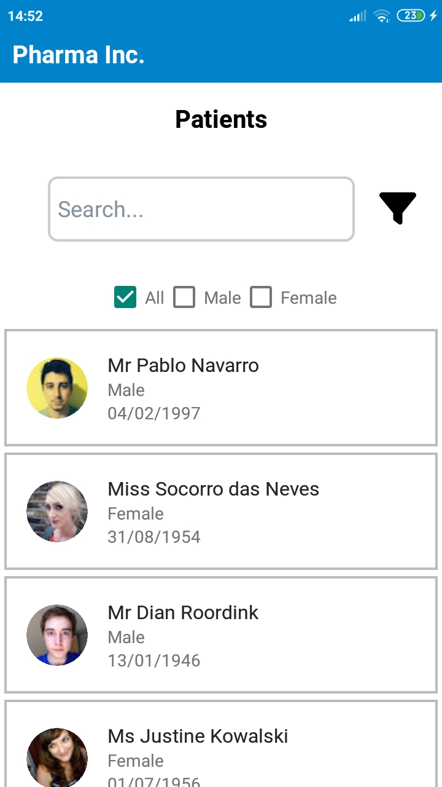
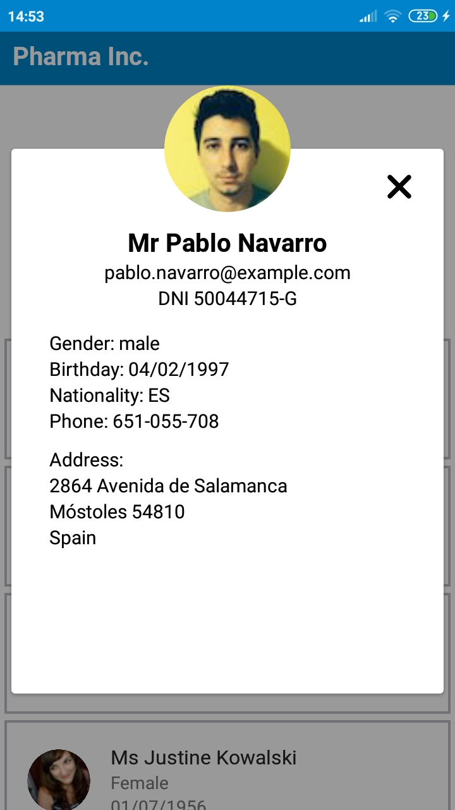

# Pharma Inc.
This is a project proposed by a recruiting company that consists of an Android app that retrieves a list of patients from an API and shows their information in a scrollable list. It contains a live search bar, nationality and gender filters, and a loading more button that is triggered once the scroll has reached the final patient on the list. Results are limited to 50 per request.

# Screenshots

